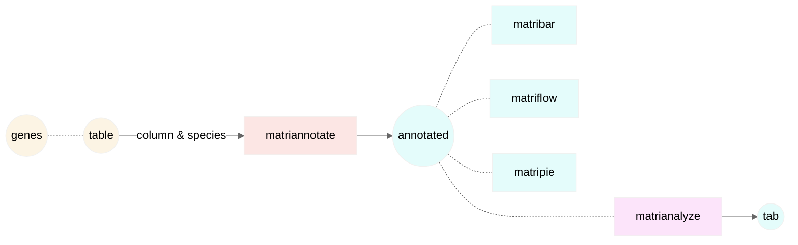

# MatrisomeAnalyzeR
_under construction_

## Abstract
**Motivation**: Identification of genes, belonging to the same (extra-)cellular component, provides important functional information and is an essential first step in the analyzis of different datasets. The extracellular matrix (ECM) is a complex meshwork of proteins that fall into specific divisions and categories, depending on their scaffolding, enzymatic and signaling activities. The [Matrisome](https://matrisomedb.org/) database provides such classification of ECM proteins, and represents a centralized resource for the analyzis of different *-omics* studies, with focus on ECM.  
**Results**: Here, we present an updated version of MatrisomeAnalyzeR (MAR) -- an automated tool, communicating with Matrisome to dissect proteomic datasets for their ECM content. MAR has been completely rewritten from the ground up and is distributed as an R package, providing numerous usability and analytical improvements.


## Installation
MatrisomeAnalyzeR dependencies are: `shiny`, `DT`, `dplyr`, `data.table`, `ggplot2`, `shinyWidgets`, `shinyjs`, `shinyhelper`. On a stock R environment ("no third-party packages installed), follow these steps:
```R
install.package("shiny")
install.package("DT")
install.package("dplyr")
install.package("data.table")
install.package("ggplot2")
install.package("shinyWidgets")
install.package("shinyjs")
install.package("shinyhelper")
devtools::install_github("izzilab/MatrisomeAnalyzeR")
```

The libraries should load automatically. However, if manual loading is required, this is the full list:
```R
library(shiny)
library(DT)
library(dplyr)
library(data.table)
library(ggplot2)
library(shinyWidgets)
library(shinyjs)
library(shinyhelper)
library(MatrisomeAnalyzeR)
```

## Functions provided by the package
The MatrisomeAnalyzeR package provides the following functions (given in the relative order of their typical usage):
1. `matriannotate`: adds Matrisome annotations to an input table of genes
2. `matrianalyze`: creates tabulations of *matriannotated* data
3. Post-run analyzes
   * `matribar`: creates barplots for matriannotated data
   * `matriflow`: renders an alluvial plot for matriannotated data
   * `matripie`: makes a donutpie for matriannotated data

## Example usage
The workflow (Figure 1) has 2 steps for the user to carry out:
1. Input table of genes is processed by `matriannotate` which recognizes those found in Matrisome and extracts their specific traits from the database, such as *Division* and *Category*. The user should specify the column with gene identifiers and the species (such as: `human`, `mouse`, `c.elegans`, `drosophila`, `zebrafish`, `quail`).
   * (Optional) The annotated list of genes can then be analyzed by `matrianalyze`, which takes into account the rest of the columns from the input data table.
2. The results can be visualized in three different ways by functions: `matribar`, `matriflow` and `matripie`.

```mermaid
%%{init: {'theme': 'neutral' } }%%
flowchart LR
style gl fill: #FCF4E4, stroke:#F1F1F0
style it fill: #FCF4E4, stroke:#F1F1F0
style mann fill: #FCE6E4, stroke:#F1F1F0
style at fill: #E4FCFB, stroke:#F1F1F0
style mana fill: #FCE4FA, stroke:#F1F1F0
style tb fill: #E4FCFB, stroke:#F1F1F0
style matribar fill: #E4FCFB, stroke:#F1F1F0
style matriflow fill: #E4FCFB, stroke:#F1F1F0
style matripie fill: #E4FCFB, stroke:#F1F1F0

gl((genes)) -.- it((table)) -- column & species --> mann[matriannotate] --> at((annotated)) -.- matribar & matriflow & matripie
at -..- mana[matrianalyze] --> tb((tab))
```
> **Figure 1. MatrisomeAnalyzeR workflow.** Input table is annotated by `matriannotate`, then parsed to `matrianalyze` for analysis.

As an demonstration, let's use the example provided by the old [MatrisomeAnalyzer](http://matrisomeproject.mit.edu/analytical-tools/matrisome-analyzer/) web-page: [matrisomeanalyzer_testfile.csv](http://matrisomeproject.mit.edu/static/media/uploads/matrisomeanalyzer_testfile.csv). In addition to Matrisome Divisions and Categories, the rest of the column headers indicate: SampleName_PeptideAbundance ( total intensity of peptide abundance), SampleName_Spectra (number of spectra), SampleName_UniquePeptides (number of unique peptides)
```R
# navigate to work dir
setwd("/path/to/workdir/")

# load table of tab-separated values
genes <- read.csv("./matrisomeanalyzer_testfile.csv", header = TRUE)

# run main for annotation
genes.ann <- matriannotate(data = genes, gene.column = "EntrezGeneSymbol", species = "human")

# tabulate the results?
genes.tbl <- matrianalyze(data = genes.ann)

# visualize results from matriannotate
matribar(data = genes.ann)
matriflow(data = genes.ann)
matripie(data = genes.ann)
```
