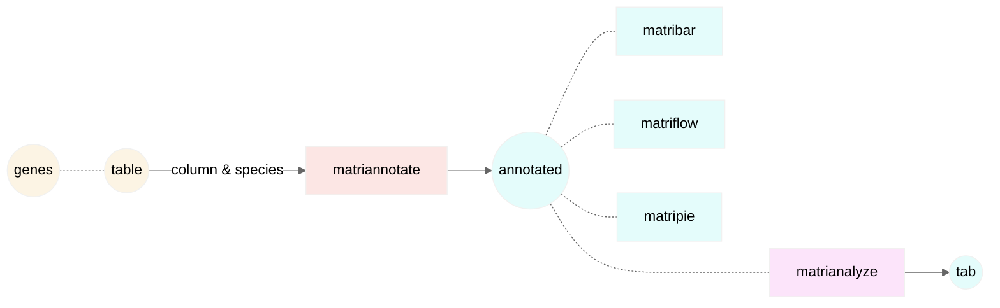
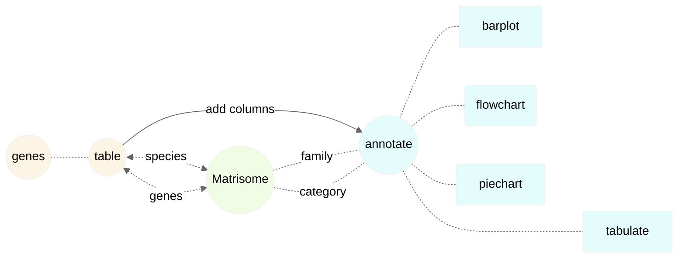
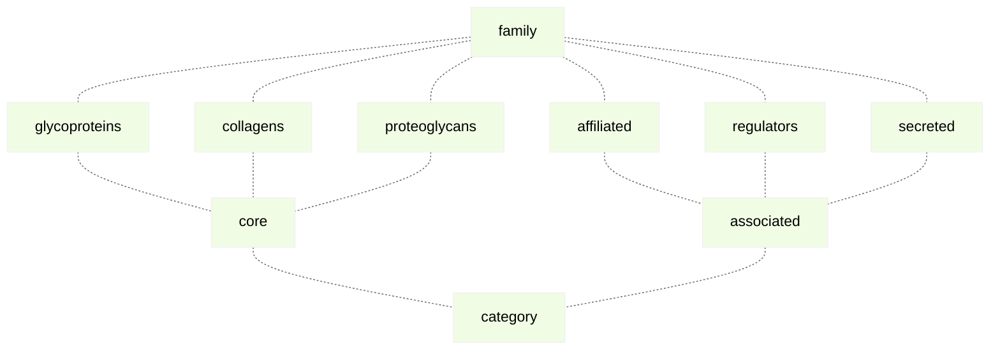

# MatrisomeAnalyzeR
_under construction_

## Abstract
**Motivation**: The identification of genes belonging to the same functional compartment provides important information about the processes happening in cells and tissues, and is an essential step in the analysis of different datasets. The extracellular matrix proper (ECM), together with the host of other proteins interacting with it, is a complex meshwork of proteins that can be organized into specific *categories* and *families*, depending on the scaffolding, enzymatic and signalling activities of each protein. The Matrisome database (MatrisomeDB) provides - among other things - a centralized, multi-species classification of ECM proteins, and is a crucial resource for the matrix-centered analysis of different *-omics* studies.  
**Results**: Here, we present an updated version of the previous [MatrisomeAnalyzeRLinuxV1](http://matrisomeproject.mit.edu/analytical-tools/matrisome-annotator/) (MAR) -- a tool intended to communicate with [MatrisomeDB](https://matrisomedb.org/) server to annotate proteomic datasets for the presence and abundance of ECM elements. We have completely rewritten MAR from the ground up, to make it faster, reactive, and compliant with a larger set of data types and multiple species. The updated MAR tool now exists in two forms, a ShinyApp (reachable from the MatrisomeBD) meant for a one-stop "click and forget" experience and the MatriAnalyzeR package, an R library providing extended usability and multiple graphical options.


## Installation
MatrisomeAnalyzeR dependencies are: `dplyr`, `data.table`, `ggplot2`, `ggalluvial`, `webr`, `crayon`, `moonBook`. On a stock R environment ("no third-party packages installed), follow these steps:
```R
install.package("dplyr")
install.package("data.table")
install.package("ggplot2")
install.package("ggalluvial")
install.package("webr")
install.package("crayon")
install.package("moonBook")
devtools::install_github("izzilab/MatrisomeAnalyzeR")
```

The libraries should load automatically. However, if manual loading is required, this is the full list:
```R
library("dplyr")
library("data.table")
library("ggplot2")
library("ggalluvial")
library("webr")
library("crayon")
library("moonBook")
library("MatrisomeAnalyzeR")
```

## Functions provided by the package
The MatrisomeAnalyzeR package provides the following functions (given in the relative order of their typical usage):
1. `matriannotate`: adds Matrisome annotations to an input table of genes/proteins
2. `matrianalyze`: creates tabulations of *matriannotated* data
3. Post-run analyses
   * `matribar`: creates barplots for matriannotated data
   * `matriflow`: renders an alluvial plot for matriannotated data
   * `matripie`: makes a donutpie for matriannotated data

## Example usage
The workflow (Figure 1) has 2 steps for the user to carry out:
1. Input table of genes is processed by `matriannotate` which recognizes those found in MatrisomeDB and extracts their specific traits from the database, such as *Family* and *Category* (Figure 3). The user should specify the column with gene/family identifiers and the species (such as: `human`, `mouse`, `c.elegans`, `drosophila`, `zebrafish`, `quail`).
   * (Optional) The annotated list of genes can then be analyzed by `matrianalyze`, which takes into account the rest of the columns from the input data table, and calculates column-wise sum (if numeric) for each category and family member.
2. The results can be visualized in three different ways by functions: `matribar`, `matriflow` and `matripie`.

```mermaid
%%{init: {'theme': 'neutral' } }%%
flowchart LR
style gl fill: #FCF4E4, stroke:#F1F1F0
style it fill: #FCF4E4, stroke:#F1F1F0
style mann fill: #FCE6E4, stroke:#F1F1F0
style at fill: #E4FCFB, stroke:#F1F1F0
style mana fill: #FCE4FA, stroke:#F1F1F0
style tb fill: #E4FCFB, stroke:#F1F1F0
style matribar fill: #E4FCFB, stroke:#F1F1F0
style matriflow fill: #E4FCFB, stroke:#F1F1F0
style matripie fill: #E4FCFB, stroke:#F1F1F0

gl((genes)) -.- it((table)) -- column & species --> mann[matriannotate] --> at((annotated)) -.- matribar & matriflow & matripie
at -..- mana[matrianalyze] --> tb((tab))
```
> **Figure 1. MatrisomeAnalyzeR workflow.** Input table is annotated by `matriannotate`, then visualized by as barplot, flow-chart and/or pie plot. Results can optionally be passed to `matrianalyze` for tabulation analysis.

As a demonstration, let's use the example provided by the old [MatrisomeAnalyzer](http://matrisomeproject.mit.edu/analytical-tools/matrisome-analyzer/) web-page: [matrisomeanalyzer_testfile.csv](http://matrisomeproject.mit.edu/static/media/uploads/matrisomeanalyzer_testfile.csv). In addition to Matrisome Divisions and Categories, the rest of the column headers indicate: SampleName_PeptideAbundance ( total intensity of peptide abundance), SampleName_Spectra (number of spectra), SampleName_UniquePeptides (number of unique peptides)
```R
# navigate to work dir
setwd("/path/to/workdir/")

# load table of tab-separated values
genes <- read.csv("./matrisomeanalyzer_testfile.csv", header = TRUE)

# run main for annotation
genes.ann <- matriannotate(data = genes, gene.column = "EntrezGeneSymbol", species = "human")

# tabulate the results?
genes.tbl <- matrianalyze(data = genes.ann)

# visualize results from matriannotate
matribar(data = genes.ann)
matriflow(data = genes.ann)
matripie(data = genes.ann)
```

## MatrisomeAnalyzeR pipeline
The individual steps of the pipeline are straighforward (Figure 2).

```mermaid
%%{init: {'theme': 'neutral' } }%%
flowchart LR
style gl fill: #FCF4E4, stroke:#F1F1F0
style it fill: #FCF4E4, stroke:#F1F1F0
style ms fill: #F1FCE4, stroke:#F1F1F0
style an fill: #E4FCFB, stroke:#F1F1F0
style tabulate fill: #E4FCFB, stroke:#F1F1F0
style barplot fill: #E4FCFB, stroke:#F1F1F0
style fl fill: #E4FCFB, stroke:#F1F1F0
style piechart fill: #E4FCFB, stroke:#F1F1F0

gl((genes)) -.- it((table)) -- add columns --> an((annotate))
it <-. species .-> ms((Matrisome))
it <-. genes .-> ms((Matrisome))
ms -. family  .- an
ms -. category .- an

an -.- barplot & fl(flowchart) & piechart
an -..- tabulate
```
> **Figure 2. MatrisomeAnalyzeR pipeline.** The input data is compared against the matrisome DB, based on the column containing genes identifiers and species. ECM genes have their characteristics added, creating an annotated version of the table. It can be visualized as a barplot, flowchart or piechart. Optionally it can be further tabulated.



```mermaid
%%{init: {'theme': 'neutral' } }%%
flowchart TB
style family fill: #F1FCE4, stroke:#F1F1F0
style category fill: #F1FCE4, stroke:#F1F1F0
style glycoproteins fill: #F1FCE4, stroke:#F1F1F0
style collagens fill: #F1FCE4, stroke:#F1F1F0
style proteoglycans fill: #F1FCE4, stroke:#F1F1F0
style affiliated fill: #F1FCE4, stroke:#F1F1F0
style regulators fill: #F1FCE4, stroke:#F1F1F0
style secreted fill: #F1FCE4, stroke:#F1F1F0
style core fill: #F1FCE4, stroke:#F1F1F0
style associated fill: #F1FCE4, stroke:#F1F1F0

family -.- glycoproteins & collagens & proteoglycans -.- core
family -.- affiliated & regulators & secreted -.- associated
core & associated -.- category
```
> **Figure 3. Matrisome organization.** Database components belong to 6 **families** that make up the *core* and *associated* **categories** of the database.