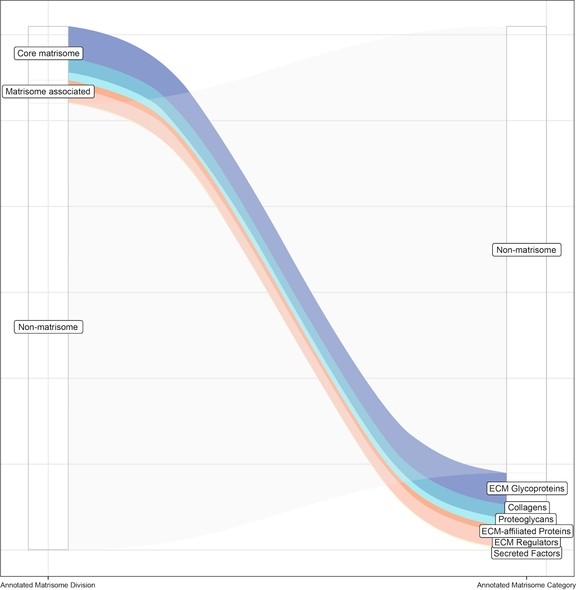
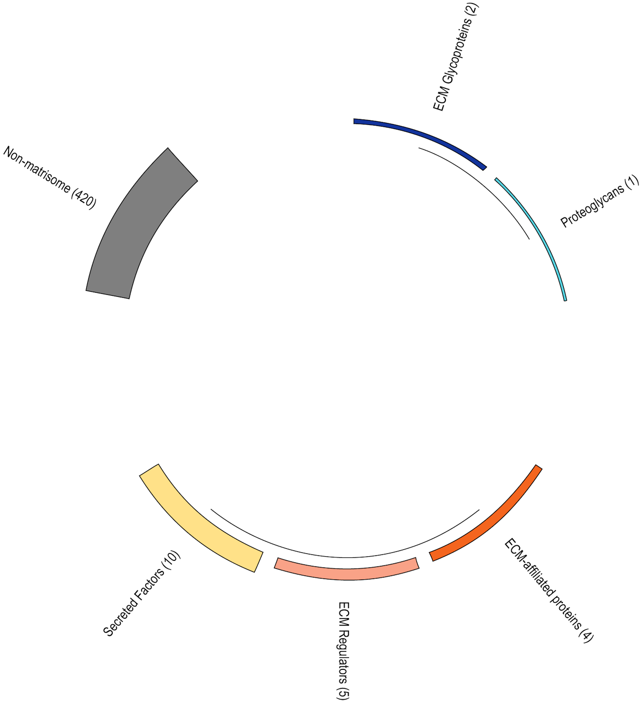
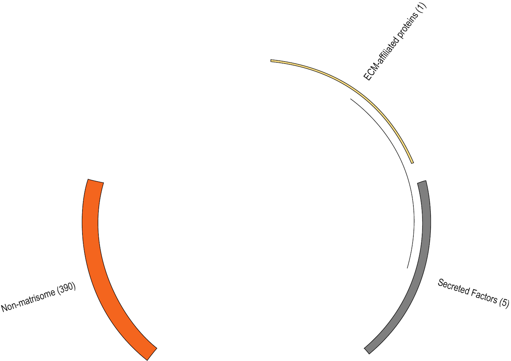

# MatrisomeAnalyzeR
If you use the MatrisomeAnalyzeR package, please cite: [Matrisome AnalyzeR: A suite of tools to annotate and quantify ECM molecules in big datasets across organisms](https://doi.org/10.1242/jcs.261255). Users can also refer to the Matrisome Project website to retrieve up-to-date lists of the matrisomes of different model organisms: https://matrisome.org. 

[](https://doi.org/10.1242/jcs.261255)
[](https://sites.google.com/uic.edu/matrisome/tools/matrisome-analyzer)
[](https://matrisome.org)

* Authors and maintainers: IzziLab (✉️ <valerio.izzi@oulu.fi>) and Naba Lab (✉️ <anaba@uic.edu>)
* This work was supported by the following grants (green: Naba lab; blue: Izzi lab):

[](https://commonfund.nih.gov/HuBMAP)
[](https://www.cancer.gov/about-nci/organization/cssi/research/imat)
[](https://www.oulu.fi/en/research/creating-better-health-our-digital-health-knowhow)

## Abstract
**Motivation**: The identification of genes or proteins belonging to the same functional compartment provides important information about the processes happening in cells and tissues, and is an essential step in the analysis of large -omic datasets. The extracellular matrix (ECM) is a complex meshwork of proteins. Its components, constituting the "matrisome", can be classified into specific *divisions* and *categories*, depending on their structure and function as scaffolding, enzymatic, and/or signalling activities. The Matrisome Project (https://matrisome.org) provides - among other resources - a centralized, multi-species classification of matrisome proteins, and has become an important resource for the ECM-centric analysis of different -omic studies.  
**Results**: Here, we present an updated version of the previous MatrisomeAnalyzeRLinuxV1 (MAR) - a tool originally intended to annotate proteomic datasets for the presence and abundance of ECM proteins. We have completely rewritten MAR from the ground up, to make it faster, reactive, and compliant with a larger panel of data types (genomic, transcriptomic, proteomic) and multiple organisms (*Human, *Mouse, *Danio Rerio, *Drosophila*, *C. elegans*). The updated MAR tool now exists in two forms: a ShinyApp (https://sites.google.com/uic.edu/matrisome/tools/matrisome-analyzer) meant for a one-stop "click and forget" experience and the MatrisomeAnalyzeR package, an R library providing extended usability and multiple graphical options.

## Installation
MatrisomeAnalyzeR dependencies are: `dplyr`, `data.table`, `ggplot2`, `ggalluvial` and `crayon`. All required packages should be automatically pulled, upon MatrisomeAnalyzeR installation. If this fails, on a stock R environment ("no third-party packages installed"), follow these steps:
```R
install.packages("dplyr")
install.packages("data.table")
install.packages("ggplot2")
install.packages("ggalluvial")
install.packages("crayon")
devtools::install_github("izzilab/MatrisomeAnalyzeR")
library("MatrisomeAnalyzeR")
```

The dependent libraries should load automatically. However, if manual loading is required, this is the complete list:
```R
library("dplyr")
library("data.table")
library("ggplot2")
library("ggalluvial")
library("crayon")
library("MatrisomeAnalyzeR")
```

## Functions provided by the package
The MatrisomeAnalyzeR package provides the following functions:
1. `matriannotate`: adds matrisome annotations (divisions and categories) to an input table of genes/proteins
2. `matrianalyze`: creates tabulations of *matriannotated* data
3. Post-run analyses
   * `matribar`: creates bar charts for matriannotated data
   * `matriflow`: creates alluvial plots for matriannotated data
   * `matriring`: creates donut charts for matriannotated data
   * `matristar`: creates polar bar charts for matriannotated data

## Workflow
The workflow (Figure 1A) has 2 steps for users to carry out:
1. The input table of genes/transcripts/proteins identifiers is processed by `matriannotate` which recognizes identifiers found in organism-specific matrisome lists and extracts their annotations from those lists, such as *Division* and *Categories* (Figure 1B), with which the pipeline can further interact. Users should specify the column with gene/protein/other identifiers and the species (such as: `human`, `mouse`, `zebrafish`, *`C. elegans`*, *`Drosophila`*). Accepted identifiers for all species are Gene Symbols, NCBI gene (formerly Entrez Gene), or Uniprot ID. Additionally, it also accepts Ensembl Gene ID for human and mouse, ZFIN ID for zebrafish, WormBase and Common Gene Name for *C. elegans*, and FlyBase ID for *Drosophila*.
   * (Optional) The annotated list of molecules can then be analyzed by `matrianalyze`, which takes into account the other columns from the input data table, and calculates column-wise sum (if numeric) for each matrisome division and category member, as well as non-matrisome components.
2. The results can be visualized in several different ways by the following functions: `matribar`, `matriring`, `matristar`, and `matriflow`. All graphical functions, by default, print the plots to screen. We have included a parameter (`print.plot`) that can be set to FALSE to avoid this behaviour and obtain a ggplot2 object instead, which can be further customized according to user preferences.

**A**

**B**

> **Figure 1. MatrisomeAnalyzeR workflow and Matrisome annotation organization.** **A. Workflow.** Input table is annotated by `matriannotate`, then visualized as a bar graph, alluvial, donut or polar-bar chart. Results can optionally be passed to `matrianalyze` for tabulation analysis. **B. Organization.** Matrisome annotations belong to 6 **categories** that make up the *core* and *associated* **divisions** which `matriannotate` interacts with.

## Usage
### Example 1: Mass spectrometry data
Let's analyze some human mass-spectrometry data, available as a comma-separated values table ([mass-spec.csv](./examples/Mass-spec/mass-spec.csv)). If you are downloading the file via your browser, you might need to click the link, then click "raw" (upper right corner) and then right-click and choose "Save as" (or similar). Results can be visualized in 4 ways (Figure 2) by the MatrisomeAnalyzeR functions listed in Figure 1A.  
Data courtesy of A. Naba, University of Illinois, Chicago.
```R
# download the "mass-spec.csv" file from the "examples/Mass-spec" folder in this repository to your working directory.
# then, load it into R and determine which column contains gene names.
# this file is also automatically loaded as "testfile" when the package is loaded.
genes <- read.csv("mass-spec.csv", header = TRUE)
head(genes)
colnames(genes)

# run the main function for annotation, specifying the gene names column ("Gene.Symbol") and organisms/species
genes.ann <- matriannotate(data = genes, gene.column = "Gene.Symbol", species = "human")

# analyze the results?
genes.tbl <- matrianalyze(data = genes.ann)

# visualize results from matriannotate
# note that all visualization functions contain a "print.plot" parameter set to TRUE by default.
# setting it to FALSE won't print the graph but return a ggplot2 object for further customization.
matribar(data = genes.ann)
matriflow(data = genes.ann)
matriring(data = genes.ann)
matristar(data = genes.ann)

# in case you want to change colors, for example using the "ggsci package".
library(ggsci)
p <- matribar(data = genes.ann, print.plot = FALSE)
p + scale_fill_npg()
```
|matribar|matriflow|matriring|matristar|
|:-:|:-:|:-:|:-:|
|||||

> **Figure 2. MatrisomeAnalyzeR visualization options.** The majority of proteins in this test file do not belong to the Matrisome, however those that do mainly belong to the the ECM glycoprotein, collagen, and ECM regulator categories. Exact numbers are explicitly printed in the *matriring* and *matristar* charts.

### Example 2: Whole Exome Sequencing (WES) (data from [cBioPortal](https://www.cbioportal.org))
In this example, we use data from whole-exome sequencing of 817 invasive breast carcinoma tumor/normal pairs (The Cancer Genome Atlas - Breast Invasive Carcinoma Project: [TCGA, Cell 2015](https://www.cbioportal.org/study/summary?id=brca_tcga_pub2015); PMID: [26451490](https://pubmed.ncbi.nlm.nih.gov/26451490/)) to evaluate the mutation frequency of matrisome and non-matrisome genes. Data from four types of invasive breast carcinomas are provided as `.txt` files. If downloading the files from your browser, you might need to click on the link, then click "raw" (upper right corner) and then right-click and choose "Save as" (or similar).
* **IDC**: [Breast Invasive Ductal Carcinoma](./examples/Breast%20Invasive%20Carcinoma%20(TCGA%2C%20Cell%202015)/Breast%20Invasive%20Ductal%20Carcinoma.txt) (490 samples)
* **ILC**: [Breast Invasive Lobular Carcinoma](./examples/Breast%20Invasive%20Carcinoma%20(TCGA%2C%20Cell%202015)/Breast%20Invasive%20Lobular%20Carcinoma.txt) (127 samples)
* **Mixed**: [Breast Mixed Ductal and Lobular Carcinoma](./examples/Breast%20Invasive%20Carcinoma%20(TCGA%2C%20Cell%202015)/Breast%20Mixed%20Ductal%20and%20Lobular%20Carcinoma.txt) (88 samples)
* **Other**: [Invasive Breast Carcinoma](./examples/Breast%20Invasive%20Carcinoma%20(TCGA%2C%20Cell%202015)/Other%20Invasive%20Breast%20Carcinoma.txt) (112 samples)

Comparison of the four cancer types (Figure 3):
```R
# download the four txt files from the "examples/Breast Invasive Carcinoma (TCGA Cell 2015)" folder in this repository to your working directory.
# then, load them into R.
ductal <- read.delim(file = "Breast Invasive Ductal Carcinoma.txt", header = T)
lobular <- read.delim(file = "Breast Invasive Lobular Carcinoma.txt", header = T)
mixed <- read.delim(file = "Breast Mixed Ductal and Lobular Carcinoma.txt", header = T)
other <- read.delim(file = "Invasive Breast Carcinoma.txt", header = T)

# as an example, we could work on Invasive Ductal Carcinoma: transform the frequency of mutations from character (has "%")
# to numeric, sort the table by decreasing mutation counts, select top-250 genes, process by matriannotate and generate a graph
ductal$Freq <- as.numeric(gsub("%","",ductal$Freq))
ductal <- ductal[order(-ductal$Freq),]
ductal <- ductal[1:250,]
ductal.ann <- matriannotate(data = ductal, gene.column = "Gene", species = "human")
matriring(data = ductal.ann)

# to process all in a loop:
cancers = c("ductal", "lobular", "mixed", "other")
for (i in cancers) {
  c <- get(i)
  c$Freq <- as.numeric(gsub("%","",c$Freq))
  c <- c[order(-c$Freq),]
  c <- c[1:250,]
  c.ann <- matriannotate(data = c, gene.column = "Gene", species = "human")
  nam <- paste(i, "ann", sep = ".")
  assign(nam, c.ann)
}
matriring(data = ductal.ann)
matriring(data = lobular.ann)
matriring(data = mixed.ann)
matriring(data = other.ann)
```

|Invasive Ductal carcinoma (IDC)|Invasive Lobular carcinoma (ILC)|Mixed Ductal and Lobular carcinoma|Other Invasive breast carcinoma|
|:-:|:-:|:-:|:-:|
|/idc.png)|/ilc.png)|/mixed.png)|/other.png)|


> **Figure 3. Comparison of the mutation frequency of matrisome and non-matrisome genes across invasive breast cancer types.** Output by `matriring`. All cancer types bear mutations in different ECM components, with a relatively uniform distribution across ECM categories, likely a hallmark of their invasive nature. Note, however, the interesting switch from the predominantly "ECM-affiliated-protein-rich" profile of Invasive Ductal Carcinoma (IDC) subtype to the "ECM-glycoproteins/ECM-regulator-rich" profile of Invasive Lobular Carcinoma (ILC) subtype.

### Example 3. Single-cell RNAseq analysis (Seurat object)
Here, we use the PBMC 3k data from the [Seurat tutorial](https://satijalab.org/seurat/articles/pbmc3k_tutorial.html). Following the worflow and completing the tutorial, the final file (`pbmc3k_final.rds`) contains 9 cell clusters (labelled 0-8) that correspond to the following cell types: Memory CD4 T, B, CD14+ Mono, NK, CD8 T, Naive CD4 T, FCGR3A+ Mono, DC, Platelet. Here, we visualize the active matrisome genes by cell type with `matriring` (Figure 4).

```R
# load Seurat and the processed PBMC example. The cells identities (Idents) are in the "new.cluster.ids" column from the file's metadata.
library(Seurat)
# follow the tutorial to generate the "pbmc3k_final.rds" file.
pbmc <- readRDS("./pbmc3k_final.rds")

# for a single cell cluster (e.g. memory CD4 T cells, belonging to cluster 0): determine
# the average expression of genes per cell type (avg), get genes with averaged expression > 3 (gns),
# set genes column name to "Gene.Symbol". Then run matriannotate and visualize data by matristar.
cluster_0.avg <- as.data.frame(AverageExpression(object = subset(pbmc, idents = "Memory CD4 T")))
cluster_0.gns <- as.data.frame(rownames(subset(x = cluster_0.avg, subset = cluster_0.avg$all > 3)))
colnames(cluster_0.gns) <- "Gene.Symbol"
cluster_0.ann <- matriannotate(data = cluster_0.gns, gene.column = "Gene.Symbol", species = "human")
matristar(cluster_0.ann)

# here's the same in a loop to process all cell clusters automatically.
clusters <- c(0:8)
names(clusters) <- c("Memory CD4 T", "B", "CD14+ Mono", "NK", "CD8 T", "Naive CD4 T", "FCGR3A+ Mono", "DC", "Platelet")
for (i in clusters) {
    avg <- as.data.frame(AverageExpression(object = subset(pbmc, idents = names(clusters[i+1]))))
    gns <- as.data.frame(rownames(subset(x = avg, subset = avg$all > 3)))
    colnames(gns) <- "Gene.Symbol"
    ann <- matriannotate(data = gns, gene.column = "Gene.Symbol", species = "human")
    nam <- paste("cluster", i, sep = "_")
    assign(nam, ann)
}
matristar(cluster_0)
matristar(cluster_1)
matristar(cluster_2)
matristar(cluster_3)
matristar(cluster_4)
matristar(cluster_5)
matristar(cluster_6)
matristar(cluster_7)
matristar(cluster_8)
```

|Memory CD4 T|B|CD14+ Mono|NK|CD8 T|
|:-:|:-:|:-:|:-:|:-:|
||||||
|**Naive CD4 T**|**FCGR3A+ Mono**|**DC**|**Platelet**|**Individual platelets**|
||||||

> **Figure 4. Comparison between the 9 clusters of PBMCs.** Overall, the expression of ECM genes is very low across cell types. *Secreted factors* was typically the most highly expressed ECM category, on par with the soluble nature of plasma, the only ECM "repository" of the blood. Notably, B cells had the lowest, almost absent, number of ECM expressed genes, which may depend on mature B cells residing mainly in the bloodstream and lymph nodes. The relatively high expression of various ECM categories in platelets, conversely, has known and important implications for their functions in clotting and wound healing. A `matrianalyze` barplot, spanning the individual cells present in a dataset (platelets) is shown last (see below).

Finally, we show how the `matrianalyze` function can be easily integrated with other analytical pipelines to mine information about the quantitative landscape of matrisome gene expression or matrisome protein abundance. In this example, we continue to work on the above PBMC 3k data and focus on `cluster_8` ("Platelets"), generating a graph that spans all the platelets present in this dataset. The analyzed results can be easily passed to statistical tests, *e.g.*, a two-way ANOVA evaluating matrisome annotation values as a function of the different annotations and samples.

```R
# extract cluster 0 data and append a column with gene names.
cluster_8.all <- subset(pbmc, idents = "Platelet")
cluster_8.all <- as.data.frame(as.matrix(cluster_8.all@assays$RNA@counts))
cluster_8.all$genes <- rownames(cluster_8.all)

# matriannotate and matrianalyze data.
cluster_8.MA <- matriannotate(cluster_8.all,"genes","human")
cluster_8.MA <- matrianalyze(cluster_8.MA)

# melt the analyzed results and plot a percent stacked bar plot. 
# To ease visualization, we remove all non-matrisome genes and the annotations for matrisome divisions.
cluster_8.MA <- reshape2::melt(cluster_8.MA)
cluster_8.MA <- cluster_8.MA[!(cluster_8.MA$`Matrisome Annotation`%in%c("Core matrisome","Matrisome-associated","Non-matrisome")),]
ggplot(cluster_8.MA,aes(x=variable,y=value,fill=`Matrisome Annotation`)) +
  geom_bar(stat="identity",position="fill") +
  theme_classic() + theme(axis.title.x=element_blank(),
                          axis.text.x=element_blank(),
                          axis.ticks.x=element_blank()) +
  ylab("% Matrisome components")

# 2-way ANOVA of the results.
cluster8.test <- aov(value ~ `Matrisome Annotation` + variable, data = cluster_8.MA)
summary(cluster_8.test)
```
R output:
```
                          Df Sum Sq Mean Sq F value   Pr(>F)    
`Matrisome Annotation`  7  99036   14148  49.378  < 2e-16 ***
variable               14  15577    1113   3.883 3.98e-05 ***
Residuals              88  25214     287                     
---
Signif. codes:  0 ‘***’ 0.001 ‘**’ 0.01 ‘*’ 0.05 ‘.’ 0.1 ‘ ’ 1
---
```
Users can find additional test files in the test file gallery available at https://sites.google.com/uic.edu/matrisome/tools/matrisome-analyzer.
